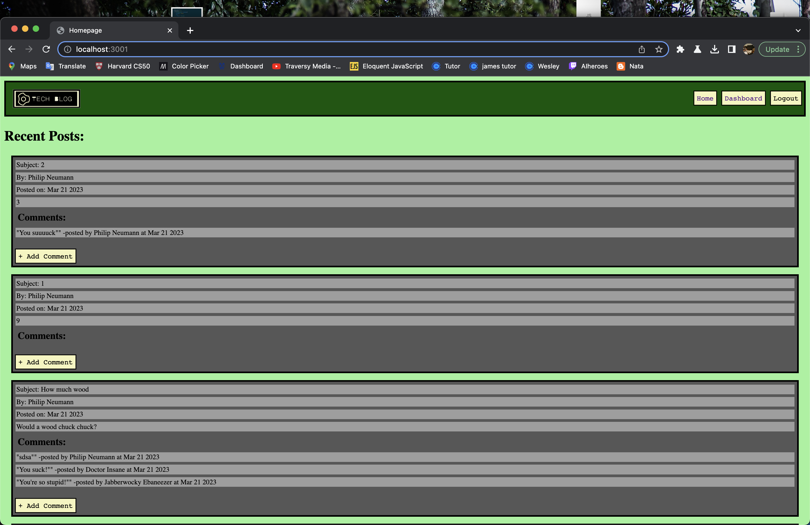

# The Tech Blog 

## Table of Contents

### [Description](#Description)

### [Installation](#Installation)

### [Usage](#Usage)

### [Testing](#Testing)

### [Contributors](#Contributors)

### [License](#License)

### [Questions](#Questions)

## Description

It is an online forum where programmers can post about coding

## Installation

No installation necessary! Simply naviate to [URL coming soon, I'm locked out of Heroku for the time being :(] and start posting

## Usage

First, you must reigster, then you can interact with other posts and write your own!

## Testing

Please write out an extenive library of jest .test scripts and run them. Also, make a pull request!

## Contributors

I built it from scratch. There were a few long conversations with ChatGPT to help with the debugging process

## License

It is an online forum where programmers can post about coding

## Questions

Philip Scott Neuman

https://github.com/moviefan322

philman202@yahoo.com
